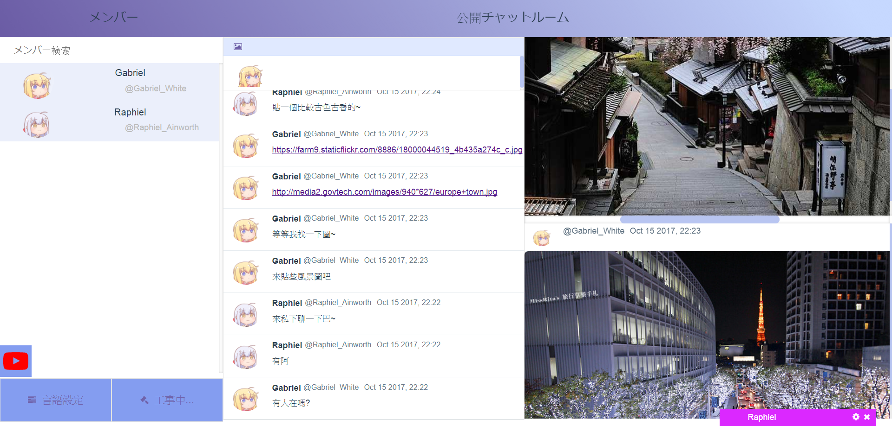

# vue-chatroom

> chatroom



## What is it
It is a real-time web chatroom develped in javascript, socket.io and other web technologies.
Web technologies like Vue.js framework and vuex-i18n library and moment.js are used in this project.

### Demo
[Try it!](https://sly-rayon.glitch.me/#/)

### How to login
+ Nickname and AccountID is required(6-8 characters). 
+ You can input the url of the image you like. If this field is empty, system will choose image for you randomly. 

#### Video

<a href="https://www.youtube.com/embed/m2aEb5VE5Rs" target="_blank">
    
</a>


## Build Setup

``` bash
# install dependencies
npm install

# serve with hot reload at localhost:8080
npm run dev

# build for production with minification
npm run build

# build for production and view the bundle analyzer report
npm run build --report
```


